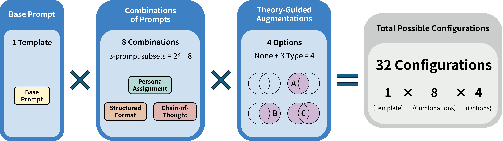

# Conceptual Metaphors in Korean Restaurant Reviews
<h2 style="border-bottom: none;">Supplementary Materials — JWLLP 35</h2>

## Prompt Components

Each component is summarized below. Full prompt texts are available in [`prompts/`](prompts/).

### Base Prompt

Basic instructions the model follows: task definition, background knowledge, and output format
* **Task Definition**: Specifies the task of extracting one metaphorical expression in a given Korean sentence
* **Background Knowledge**: Explains the definition of metaphor, the target context (Korean restaurant reviews), and the 10 concept types used as metaphors
* **Output Format**: Instructs to output a single string or an empty string, while restricting other responses to ensure a short-answer format

```
Extract ONE metaphorical expression from the given Korean sentence that is related to the 10 target domains.

Your task:
Analyze the sentence and identify ONE metaphorical expression used to describe concepts within the following 10 domains.
Extract the exact metaphorical phrase as it appears in the sentence.

**What is a Metaphor?**
A metaphor is a figure of speech where a word or phrase is applied to something in a non-literal way to suggest a resemblance or comparison.
- It involves using one thing to represent or describe another
- The literal meaning doesn't make sense, but the figurative meaning conveys an idea

**Domain Context:**
This task investigates metaphors in Korean restaurant reviews.
Please focus specifically on the following 10 concepts that could be expressed metaphorically in restaurant reviews:
- 맛 (taste)
- 친절 (kindness)
- 가격 (price)
- 음식 (food)
- 가성비/양 (cost-effectiveness/quantity)
- 분위기 (atmosphere)
- 식당 (restaurant)
- 메뉴 (menu)
- 서비스 (service)
- 주문 (order)

**Instructions:**
1. Read the sentence carefully
2. Identify ONE phrase that is used non-literally to describe any of the 10 target domains
3. Extract ONLY ONE metaphorical expression as it appears in the original sentence
4. If multiple metaphors exist, choose the most prominent one
5. If no metaphor exists, return an empty string

**Important:**
- Extract ONLY ONE metaphorical phrase, not entire sentences
- Keep the expression as it appears in the original text
- Do not provide explanations or additional text
- Return only a string(use quotes for non-empty strings)

**Output Format:**
Return your answer as a single string (not a list).
- If a metaphor is found: "metaphorical expression"
- If no metaphor is found: ""


Output format:
Answer: "metaphorical expression" or ""

Provide ONLY a single string as your final answer.

Input sentence: {input}

Answer:
```

### Persona Assignment

Assigns a persona or role to the LLM within the prompt to enhance its understanding of the task to be performed (White et al. 2023)

**Purpose**: Activate domain-expert knowledge

```
You are a linguistics expert specializing in metaphor analysis in Korean restaurant review analysis.
```

### Structured Format

Delivers the task in a structured format to improve clarity and guide responses toward the intended task (Bsharat et al. 2023)
* Prompt format distinguishes role, task, constraints, output format, and system instructions and user input is marked to improve clarity and guide responses toward the intended task

**Purpose**: Reduce ambiguity via XML-like structuring

```
<system>
<role>
You are a linguistics expert ...
</role>
<task>
...
</task>
...
</system>
<user>
Input sentence: {input}
</user>

<assistant>
```

### Chain-of-Thought

Applies the CoT prompt technique proposed by Wei et al. (2022)
* Modified the output format to include a step-by-step reasoning process regarding the identification of a metaphor and an explanation of why it is classified as such within `<reasoning> … </reasoning>`  section before producing the final result

**Purpose**: Step-by-step reasoning before answer

```
Output format:
<reasoning>
(Provide your step-by-step reasoning about what metaphor exists and why it is metaphorical)
</reasoning>
Answer: "metaphorical expression" or ""
```

### Theory-Guided Augmentation

Provides theoretical background knowledge regarding Conceptual Metaphor Theory (CMT)
* **Type A**: The theoretical background and definition such as Lakoff & Johnson’s CMT background
* **Type B**: Examples of cross-domain mapping in CMT (e.g., PRICE IS PERSONALITY), which is inspired by few-shot prompting (Brown et al. 2023)
* **Type C**: Provides combination of both Type A and Type B

**Purpose**: Inject CMT knowledge into the prompt

#### Type A — Theoretical background

```
## Conceptual Metaphor Theory (CMT) Background:
CMT, developed by Lakoff and Johnson (1980), proposes that metaphor is a fundamental cognitive mechanism through which we understand abstract concepts (TARGET domain) via more concrete concepts (SOURCE domain).

### CMT Definition of Metaphor:
From the CMT perspective, a metaphor is NOT just a figure of speech, but a cognitive mapping:
- **Metaphor = Systematic mapping from SOURCE domain to TARGET domain**
- Abstract concepts (TARGET) are understood through concrete experiential concepts (SOURCE)

### Core Principles:
1. **TARGET IS SOURCE Framework**: 
   Abstract concepts are systematically understood through concrete experiential domains.
   This is not merely a linguistic phenomenon but a fundamental aspect of human cognition.
2. **TARGET Domain**: 
   The abstract concept being understood or described.
   Examples: emotions, time, ideas, relationships, qualities, experiences
3. **SOURCE Domain**: 
   The concrete concept providing the conceptual structure for understanding.
   Typically drawn from physical experience, spatial relations, bodily states, or basic-level concepts.
   Examples: physical objects, actions, movements, spatial locations, bodily sensations

### Identifying Metaphors using CMT:
1. Look for phrases where literal meaning doesn't fit the context
2. Identify the abstract concept being described (TARGET)
3. Determine the concrete domain being used (SOURCE)
4. Verify systematic mapping exists (not just isolated word usage)
```

#### Type B — Mapping examples

```
## CMT Mapping Knowledge Graph:
This knowledge graph represents common conceptual metaphor mappings in Korean.
Mappings follow the structure: TARGET IS SOURCE
Below are the examples of common conceptual metaphor mappings:

### Emotion & Experience:
- 감동적인 맛 → TASTE IS EMOTION
- 퀄리티 미쳤다 → QUALITY IS MENTAL STATE
- 만점짜리 경험 → EXPERIMENCE IS EXAM

### Price & Value:
- 가격이 착해요 → PRICE IS PERSONALITY
- 가성비 대박 → COST-EFFECTIVENESS IS GAMBLING
- 값이 나가네 → PRICE IS MOVEMENT

### Service & Atmosphere:
- 따뜻한 분위기 → ATMOSPHERE IS TEMPERATURE
- 서비스 죽이네 → SERVICE IS CRIME
- 추억이 살아 숨쉬는 → MEMORY IS LIFE
```

#### Type C — Combined (A + B)

Both Type A and Type B included in the prompt.

---

## 32 Configurations

| # | Persona | Structured | CoT | CMT Type |
|---|---------|------------|-----|----------|
| 1 | ✗ | ✗ | ✗ | None |
| 2 | ✗ | ✗ | ✗ | A |
| 3 | ✗ | ✗ | ✗ | B |
| 4 | ✗ | ✗ | ✗ | C |
| 5 | ✓ | ✗ | ✗ | None |
| ... | ... | ... | ... | ... |
| 32 | ✓ | ✓ | ✓ | C |



## Assembled Prompt Examples

The individual components in `prompts/` are combined into full prompts as follows. Three examples are shown in [`examples/`](examples/).

---

<!-- ## Evaluation

Token-level Precision / Recall / F1 using
Kiwi morphological analyzer.

See `evaluation/` for implementation.

---

## Citation

[citation block]

## Contact

[email] -->

---

[](https://hits.seeyoufarm.com)
